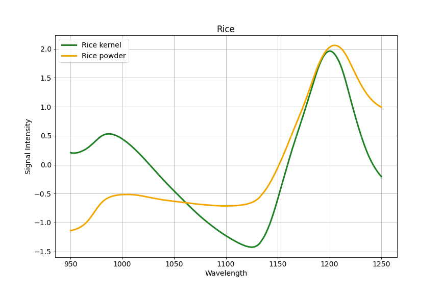
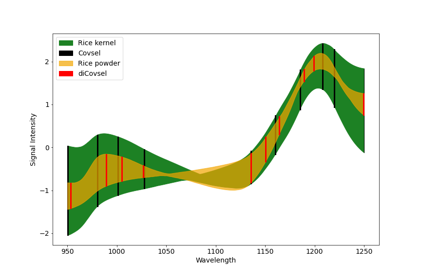
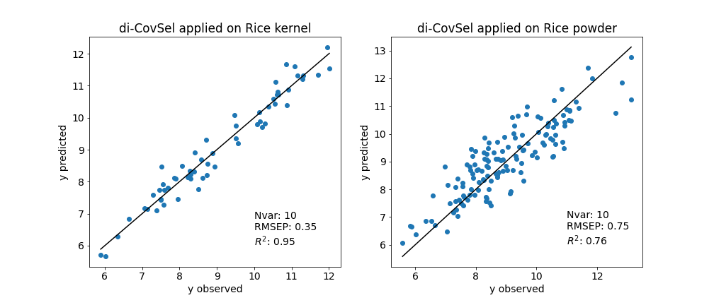

# Domain Invariant Covariate Selection (di-CovSel)

Implementation of di-CovSel for domain invariant selection of variables.



# Perform di-CovSel

Selection of variables

```python
from dicovsel_functions import dicovsel

di_nvars = 10
l_chosen = 1e6
dicovsel_output = dicovsel(X=Xs,Y=Ys,Xs=Xs, Xt=Xt,nvar=di_nvars_max, l = l_chosen,scaleY = False, weights = None)
selected_dicovsel = dicovsel_output[0]


# The tuning parameters can be chosen with cross-validation

```

Train OLS model with selected variables

```python
from sklearn.linear_model import LinearRegression

mlr_dicovsel = LinearRegression()
mlr_dicovsel.fit(Xs[:, selected_dicovsel[0:di_nvars]],Ys)
Ys_test_pred = mlr_dicovsel.predict(Xs_test[:, selected_dicovsel[0:di_nvars]])
Yt_test_pred = mlr_dicovsel.predict(Xt_test[:, selected_dicovsel[0:di_nvars]])

```

## Selected variables



## di-CovSel performance




# Acknowledgements
di-CovSel was developed in collaboration with Puneet Mishra, Jean-Michel Roger and Wouter Saeys.

- V.F. Diaz, P. Mishra, J.-M. Roger, W. Saeys, Domain invariant covariate
selection (Di-CovSel) for selecting generalized features across domains, Chemometrics and Intelligent
Laboratory Systems (2022), doi: https://doi.org/10.1016/j.chemolab.2022.104499.

# References
This work was inspired and based on the original development of Domain Invariant Partial Least Squares

- *Ramin Nikzad-Langerodi, Werner Zellinger, Susanne Saminger-Platz, Bernhard A. Moser,
Domain adaptation for regression under Beer–Lambert’s law,
Knowledge-Based Systems, Volume 210, 2020, https://doi.org/10.1016/j.knosys.2020.106447.*


# Files in the repository

* class_sample_selection.py: Algorithms for unsupervised sample selection. See https://doi.org/10.1016/j.chemolab.2021.104352
* dicovsel_functions.py: di-CovSel algorithm and original CovSel algorithm.
* dipls_function.py: Original di-PLS algorithm for comparison. See https://github.com/B-Analytics/di-PLS
* rice_dicovsel.ipynb: Reproducibility of results for Rice data in di-CovSel publication https://doi.org/10.1016/j.chemolab.2022.104499.
* rice_kernel_to_powder.mat: Data used for Rice case study in the di-CovSel publication.